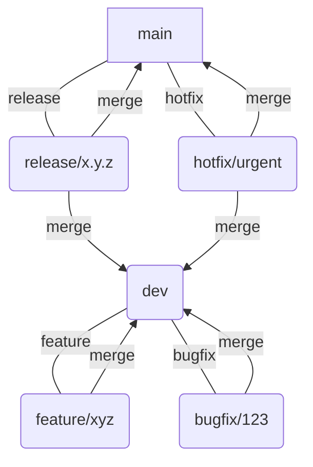

# Git Flow Workflow

This document outlines the Git workflow we generally follow for AquaPower projects. While specific project needs might dictate minor variations, this serves as our standard.

## Main Branches

We primarily utilize the following long-lived branches:

*   **`main`**: This branch represents the **production-ready** or **release-ready** state of the project. Only stable, fully tested, and approved code should reside here. Direct commits to `main` are strictly prohibited. Merges into `main` typically originate from `dev` via a Pull Request after thorough testing and code review.
*   **`dev`**: This branch serves as the **integration branch** for all new features and bug fixes. All new development work (feature branches) should branch off `dev`. Once a feature is complete and reviewed, it's merged back into `dev`. This branch is continuously tested and aims to be in a deployable state, though it might contain features not yet ready for a full release.

## Visual Git Flow Diagram

Below is a visual representation of the Git Flow using Mermaid syntax. You can preview this diagram using Mermaid-enabled Markdown viewers or online editors:

## Supporting Branches (Short-Lived)

These branches are used for specific development tasks and have a limited lifespan. They are typically deleted after being merged.

*   **Feature Branches (`feature/<feature-name>` or `sistema/feature/<feature-name>`)**:
    *   **Purpose:** To develop new features or significant improvements.
    *   **Origin:** Always branch off `dev`.
    *   **Merge Target:** Merge back into `dev` after completion and code review.
    *   **Example:** `git checkout -b avionics/feature/new-sensor-driver dev`
*   **Bugfix Branches (`bugfix/<issue-number>` or `sistema/bug/<issue-name>`)**:
    *   **Purpose:** To fix bugs, typically identified via an issue tracker.
    *   **Origin:** Always branch off `dev`.
    *   **Merge Target:** Merge back into `dev` after completion and code review.
    *   **Example:** `git checkout -b PDA/bug/fix-calibration-issue-15 dev`
*   **Hotfix Branches (`hotfix/<issue-number>`)**:
    *   **Purpose:** To quickly address critical bugs in the `main` (production) branch that cannot wait for the next `dev` release cycle.
    *   **Origin:** Branch off `main`.
    *   **Merge Target:** **Must** be merged back into both `main` and `dev` to ensure the fix is propagated to both branches.
    *   **Example:** `git checkout -b hotfix/critical-data-loss-32 main`
*   **Release Branches (`release/<version-number>`)**:
    *   **Purpose:** To prepare for a new production release. This branch is used for final testing, bug fixing, and preparing metadata (e.g., version numbers).
    *   **Origin:** Branch off `dev`.
    *   **Merge Target:** When ready, it's merged into `main` (and tagged with the release version) and also merged back into `dev` to include any last-minute fixes made during the release preparation.
    *   **Example:** `git checkout -b release/v1.0.0 dev`

## Workflow Summary

1.  **Start New Work:**
    *   `git checkout dev`
    *   `git pull origin dev`
    *   `git checkout -b <your-feature-branch-name>`
2.  **Develop & Commit:**
    *   Make your changes.
    *   `git add .`
    *   `git commit -m "feat: your descriptive commit message"` (follow [Git Commit Message Guidelines](git_style_guide.md#git-commit-messages))
    *   Repeat as necessary.
3.  **Push to Remote:**
    *   `git push -u origin <your-feature-branch-name>`
4.  **Open a Pull Request (PR):**
    *   Once your work is complete and tested locally, open a PR from `<your-feature-branch-name>` to `dev`.
    *   Ensure your PR adheres to the [Pull Request Template](.github/PULL_REQUEST_TEMPLATE.md) and our [Contributing Guidelines](.github/CONTRIBUTING.md).
5.  **Code Review:**
    *   Address any feedback from code reviewers.
    *   Make additional commits to your feature branch if needed.
6.  **Merge to `dev`:**
    *   Once approved, your PR will be merged into `dev`.
    *   Your feature branch can then be deleted.
7.  **Release Process (When Applicable):**
    *   When `dev` is stable and ready for a release, a `release/<version>` branch is created from `dev`.
    *   Final testing and minor fixes are done on the `release` branch.
    *   The `release` branch is then merged into `main` and tagged with the version number.
    *   The `release` branch is also merged back into `dev` to propagate any last-minute fixes.

## Hotfix Workflow

1.  **Identify Critical Bug on `main`:**
2.  **Start Hotfix Branch:**
    *   `git checkout main`
    *   `git pull origin main`
    *   `git checkout -b hotfix/<issue-number>`
3.  **Fix & Commit:**
    *   Implement the fix.
    *   `git add .`
    *   `git commit -m "fix(hotfix): <descriptive hotfix message>"`
4.  **Open PR & Merge to `main`:**
    *   Open a PR from `hotfix/<issue-number>` to `main`.
    *   After review, merge to `main` and immediately tag the new version (e.g., `v1.0.1`).
5.  **Merge to `dev`:**
    *   After merging to `main`, ensure the hotfix is also merged into `dev`:
        *   `git checkout dev`
        *   `git pull origin dev`
        *   `git merge hotfix/<issue-number>`
        *   `git push origin dev`
    *   Delete the `hotfix` branch.

---
For a visual representation of Git Flow, refer to external guides such as nvie.com/posts/a-successful-git-branching-model/
